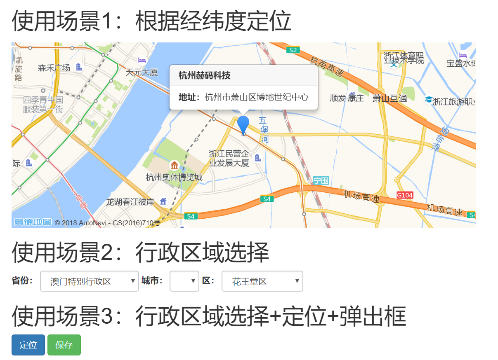
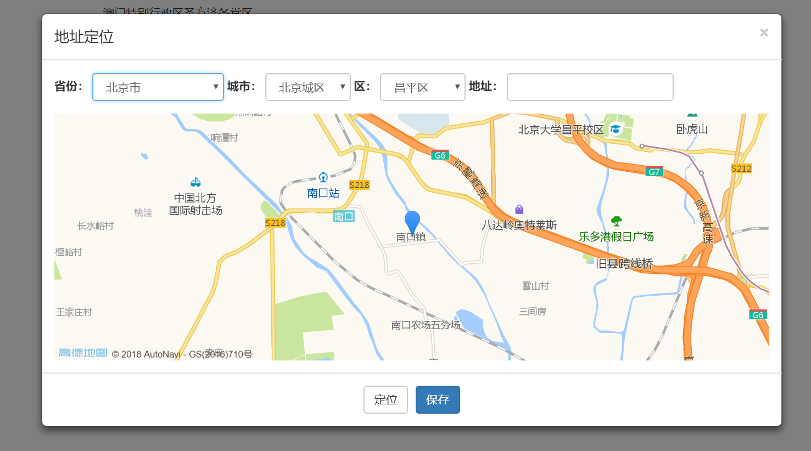
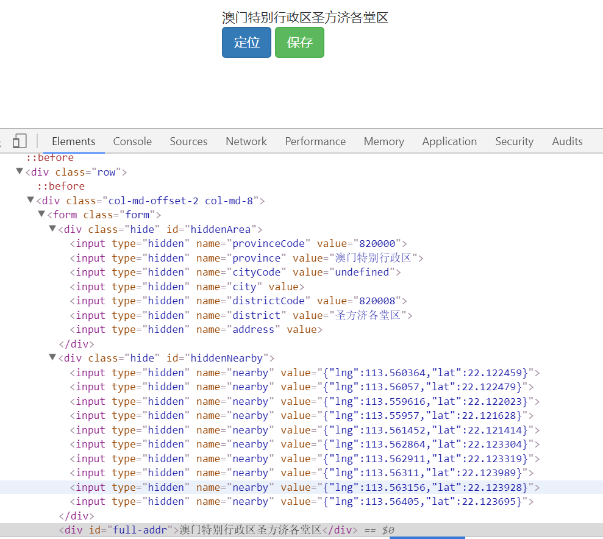

# jquery-gaodemap
高德地图jquery行政区域地址定位插件




## 根据经纬度定位

```html
<!--
    data-gaode-place="true" 开启地标的定位地图
    data-name="杭州赫码科技" 提示框的标题
    data-addr="杭州市萧山区博地世纪中心" 提示框的地址
    data-position='[120.252128,30.236821]' 经纬度

-->
<div style="margin-top:15px; width:100%; height:300px;" 
    data-gaode-place="true"
    data-name="杭州赫码科技"
    data-addr="杭州市萧山区博地世纪中心"
    data-position='[120.252128,30.236821]' >
</div>
```

## 行政区域选择

```html
<!--
    data-gaode-area="true" 开启行政区域选择控件
    data-level="province" 省份选择框
    data-level="city" 城市选择框
    data-level="district" 区/县选择框

-->
<div data-gaode-area="true">
    <div class="form-inline">
        <div class="form-group">
            <label> 省份：</label>
            <select data-level="province" class="form-control"></select>
        </div>
        <div class="form-group">
            <label> 城市：</label>
            <select data-level="city" class="form-control"></select>
        </div>
        <div class="form-group">
            <label> 区：</label>
            <select data-level="district" class="form-control"></select>
        </div>
    </div>
</div>
```

## 行政区域选择+定位+弹出框




> html代码部分

```html
<form class="form">
    <div class="hide" id="hiddenArea"></div>
    <div class="hide" id="hiddenNearby"></div>
    <div id="full-addr"></div>
    <div class="form-group">
        <button type="button" class="btn btn-primary" data-toggle="modal" data-backdrop='static' data-target="#mapModal">定位</button>
        <button class="btn btn-success">保存</button>
    </div>
    <div>
        <div class="modal fade" id="mapModal">
            <div class="modal-dialog modal-lg " id="map-box" data-auto="true" data-map="#hotel-map">
                <div class="modal-content">
                    <div class="modal-header">
                        <button type="button" class="close" data-dismiss="modal">
                            <span aria-hidden="true">×</span>
                            <span class="sr-only">关闭</span>
                        </button>
                        <h4 class="modal-title">地址定位</h4>
                    </div>
                    <div class="modal-body">
                        <div class="form-inline">
                            <div class="form-group">
                                <label> 省份：</label>
                                <select data-level="province" class="form-control"></select>
                            </div>
                            <div class="form-group">
                                <label> 城市：</label>
                                <select data-level="city" class="form-control"></select>
                            </div>
                            <div class="form-group">
                                <label> 区：</label>
                                <select data-level="district" class="form-control"></select>
                            </div>
                            <div class="form-group">
                                <label> 地址：</label>
                                <input type="text" data-level="address" class="form-control" />
                            </div>
                        </div>
                        <div style="margin-top:15px; width:100%; height:300px;" id="hotel-map" data-near-radius='2000' data-position='[120.170852,30.25868]'>
                        </div>
                    </div>
                    <div class="modal-footer" style="text-align:center;">
                        <button type="button" class="btn btn-default location-btn">定位</button>
                        <button type="button" id="save-btn" class="btn btn-primary" data-dismiss="modal">保存</button>
                    </div>
                </div>
            </div>
        </div>
    </div>
</form>
```

> js代码部分

```js
$(document).ready(function () {
    var area = $('#map-box').gaodeArea().data('map.gaode.area');
    $('#save-btn').click(function () {
        area.getValues(function (values) {
            //字段转换
            var map = {
                province: 'provinceCode',
                provinceText: 'province',
                city: 'cityCode',
                cityText: 'city',
                district: 'districtCode',
                districtText: 'district',
                address: 'address',
                location: 'geo'
            };
            //生成地理酒店地理位置信息的隐藏字段
            var html = '';
            for (var p in values) {
                var val = values[p];
                if (map[p])
                    html += '<input type="hidden" name="' + map[p] + '" value="' +
                    val + '"/>';
            }
            $('#hiddenArea').html(html);

            //组合完整地址
            $('#full-addr').html(
                values['provinceText'] +
                values['cityText'] +
                values['districtText'] +
                values['address']);
        });
        //查询酒店周边的信息,并生成隐藏字段
        area.searchNearBy('地铁站|机场|景点|公交站', function (pois) {
            $('#hiddenNearby').html($.map(pois, function (item) {
                var lng = item.location.lng;
                var lat = item.location.lat;
                var geo = '{"lng":' + lng + ',"lat":' + lat + '}';
                return "<input type='hidden' name='nearby' value='" +
                    geo + "'/>";
            }).join(''));
        });
    });
    $('form').submit(function () {
        //如果直接提交表单，return true
        //如果ajax提交表单，在这里编写异步提交。return false
        return false;
    });
});
```


MIT License

Copyright (c) 2018 顿刚

Permission is hereby granted, free of charge, to any person obtaining a copy
of this software and associated documentation files (the "Software"), to deal
in the Software without restriction, including without limitation the rights
to use, copy, modify, merge, publish, distribute, sublicense, and/or sell
copies of the Software, and to permit persons to whom the Software is
furnished to do so, subject to the following conditions:

The above copyright notice and this permission notice shall be included in all
copies or substantial portions of the Software.

THE SOFTWARE IS PROVIDED "AS IS", WITHOUT WARRANTY OF ANY KIND, EXPRESS OR
IMPLIED, INCLUDING BUT NOT LIMITED TO THE WARRANTIES OF MERCHANTABILITY,
FITNESS FOR A PARTICULAR PURPOSE AND NONINFRINGEMENT. IN NO EVENT SHALL THE
AUTHORS OR COPYRIGHT HOLDERS BE LIABLE FOR ANY CLAIM, DAMAGES OR OTHER
LIABILITY, WHETHER IN AN ACTION OF CONTRACT, TORT OR OTHERWISE, ARISING FROM,
OUT OF OR IN CONNECTION WITH THE SOFTWARE OR THE USE OR OTHER DEALINGS IN THE
SOFTWARE.